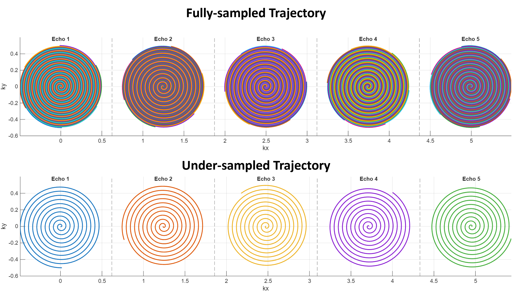

# Non-Cartesian-SSDU-MRI

<p align="center">
  
</p>

## Abstract

This repository provides preprocessing and reconstruction utilities for self-supervised non-Cartesian MRI reconstruction using SSDU-style data splitting. The framework focuses on multi-echo spiral MRI data, including trajectory handling, density compensation, sampling mask generation, and preparation of training and validation measurements for reconstruction experiments.

Non-Cartesian acquisitions such as spiral imaging offer efficient k-space coverage and improved scan-time flexibility, but they require careful handling of trajectory information, density compensation, and undersampling masks. This repository is designed to support experiments where the acquired k-space measurements are divided into disjoint subsets for self-supervised training and loss evaluation, reducing dependence on fully sampled reference data.

The preprocessing pipeline includes visualization of full and single-shot spiral trajectories, generation of training and validation masks, and organization of data structures needed for downstream reconstruction models. The provided figures summarize the trajectory design and the resulting temporal signal-to-noise ratio behavior across the reconstructed data.

<p align="center">
  
</p>


## Quick Start
Note: This code was tested with `torch==2.2.1+cu121`. 

## Installation

**Note:** This code was tested with `torch==2.2.1+cu121`.

### 1. Clone this repository

```bash
git clone https://github.com/MahdiSaberii/Non-Cartesian-SSDU-MRI.git
cd Non-Cartesian-SSDU-MRI
```

### 2. Create and activate conda environment

```bash
conda create -n non_cartesian_ssdu_mri python=3.10 -y
conda activate non_cartesian_ssdu_mri
```

### 3. Install PyTorch

```bash
pip install torch==2.2.1+cu121 --index-url https://download.pytorch.org/whl/cu121
```

### 4. Install remaining requirements

```bash
pip install -r requirements.txt
```
